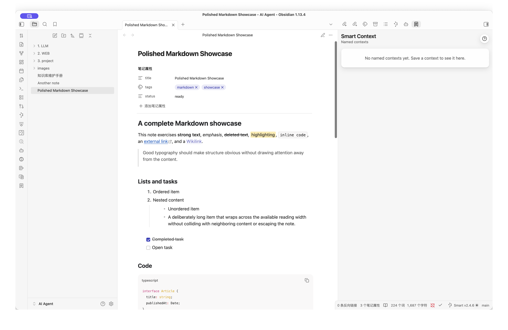
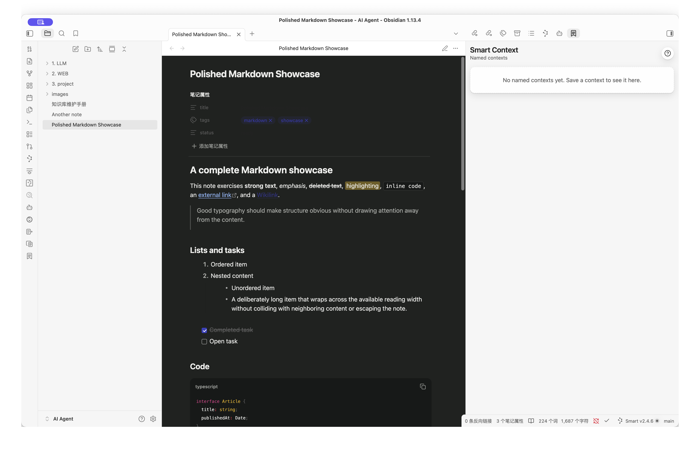
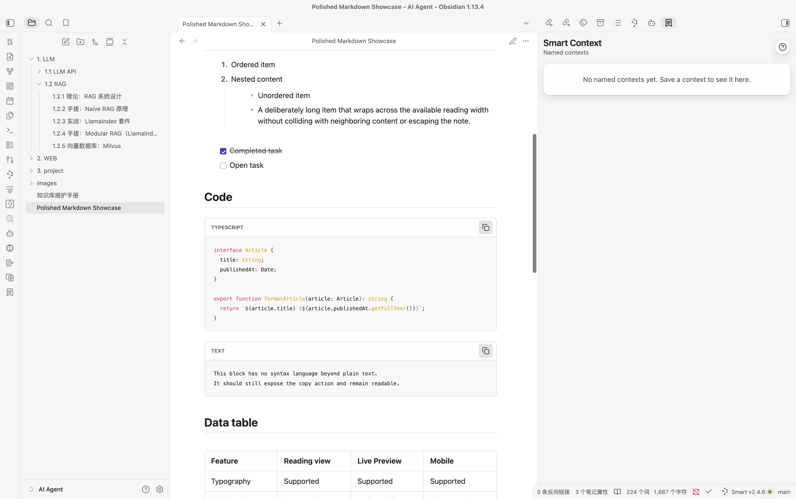
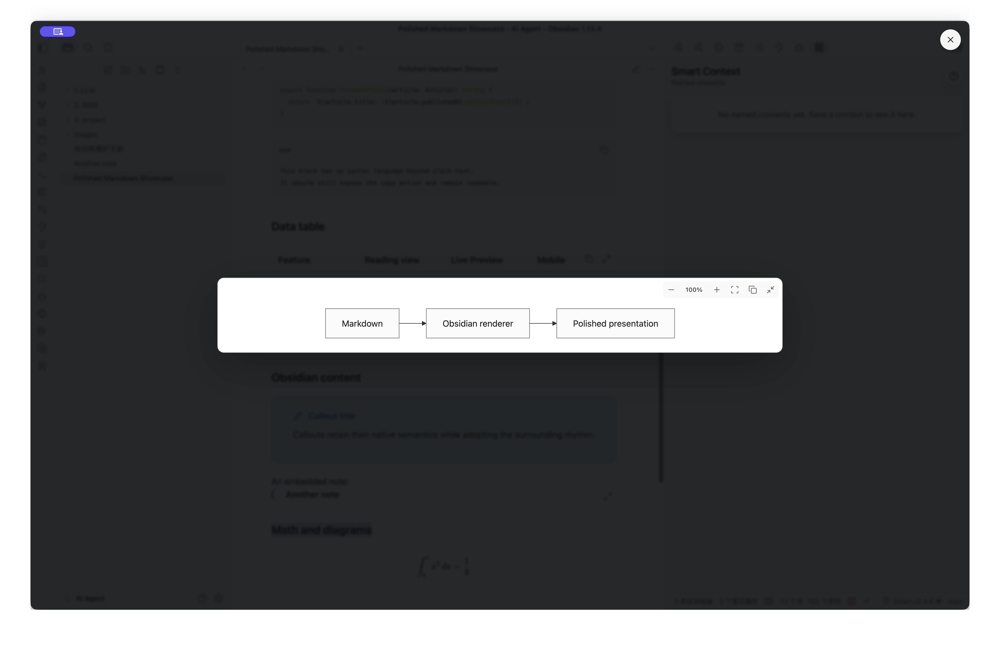

# Codex Style Markdown

[English](https://github.com/geekyfoxlab/codex-style-markdown/blob/main/README.md) | [简体中文](https://github.com/geekyfoxlab/codex-style-markdown/blob/main/README.zh-CN.md)

Codex Style Markdown gives Obsidian one coherent, polished visual system across Reading view and Live Preview. It improves long-form typography and adds practical controls for code, tables, images, Mermaid diagrams, and embedded content while keeping Obsidian's native renderer and semantics intact.

Codex Style Markdown is not affiliated with, endorsed by, or sponsored by OpenAI, ChatGPT, or Codex. Its design and source code are original.



## Problems solved

- Reading view and Live Preview no longer feel like two unrelated documents.
- Wide tables, long code, large images, and dense Mermaid diagrams remain readable without leaving the note.
- Copying a table produces reusable Markdown instead of awkward cell text.
- Visual refinement does not replace or break Wikilinks, Callouts, embeds, KaTeX, Mermaid, or Properties.

## What makes it different

Instead of requiring separate typography, code-block, table, image-viewer, and Mermaid-zoom plugins, Codex Style Markdown coordinates these surfaces in one scoped visual system. Per-note activation, multiple palettes, proportional media zoom, mobile layouts, print styles, and reduced-motion support are designed to work together.

## Features

- Coordinated typography for Reading view and Live Preview
- Auto, Light, and Dark content modes with Graphite, Forest, and Spectrum palettes
- Responsive tables and media
- Code language labels, copy actions, optional line numbers, and long-block folding
- Table copy actions that produce reusable Markdown
- Mermaid zoom, fit-to-width, drag-to-pan, keyboard reset, and fullscreen viewing
- Keyboard-accessible image preview
- Global and opt-in activation modes
- Light, dark, mobile, reduced-motion, and print support
- Settings backed by CSS variables for immediate updates
- Chinese and English settings based on the Obsidian interface language

## Supported Markdown elements

- Text: headings, paragraphs, bold, emphasis, strikethrough, highlights, inline code, links, Wikilinks, horizontal rules, and footnotes
- Lists: ordered lists, unordered lists, compact nested levels, and task lists
- Structured content: blockquotes, Callouts, Properties, note embeds, attachment embeds, and responsive tables
- Code: native syntax highlighting, language labels, copy actions, optional line numbers, and long-block folding
- Media: responsive images, click-to-expand previews, mouse-wheel zoom, and bottom zoom controls
- Math and diagrams: native KaTeX, Mermaid themes, SVG copy, fit-to-width, drag-to-pan, fullscreen viewing, and proportional unlimited zoom
- Obsidian content: Callouts, Wikilinks, embedded notes, Properties, Mermaid, math, and generated Markdown DOM remain native and interactive

Embedded-note open controls create a new Obsidian tab, preserving the source note.

## Screenshots

| Reading view | Dark mode |
| --- | --- |
|  |  |

| Code blocks | Expanded Mermaid |
| --- | --- |
|  |  |

## Installation

### Manual release installation

1. Download `codex-style-markdown-1.0.3.zip` and extract it.
2. Place the `codex-style-markdown` folder in `<vault>/.obsidian/plugins/`.
3. In Obsidian, open **Settings → Community plugins**, reload installed plugins, and enable **Codex Style Markdown**.

### Development

```bash
npm install
npm run dev
```

Copy or link this repository into `<vault>/.obsidian/plugins/codex-style-markdown` during development. Run `npm run build` for a production bundle.

## Activation

The default Global mode applies to every note. Disable it for one note with frontmatter:

```yaml
---
cssclasses:
  - codex-style-markdown-off
---
```

In Opt-in mode, use `codex-style-markdown-on` instead. The command palette can update the active note automatically.

## Commands

- **Codex Style Markdown: Toggle globally**
- **Codex Style Markdown: Toggle for current note**
- **Codex Style Markdown: Expand or collapse all code blocks in current note**

## Mermaid controls

Rendered Mermaid diagrams include zoom out, reset percentage, zoom in, fit-to-width, SVG copy, and fullscreen controls. Expanded diagrams scale their frame and content together without a maximum zoom limit. Drag to pan, use the mouse wheel to zoom, and press `Escape` to close the expanded view.

## Appearance

The appearance mode can follow Obsidian or force Light/Dark styling for the Markdown content area. Color palettes are independent:

- **Graphite** keeps headings and surfaces neutral.
- **Forest** combines green, teal, and gold semantic colors.
- **Spectrum** uses blue, teal, amber, and rose to distinguish heading levels and diagram accents.

Code copy, table copy, and Mermaid controls can be enabled separately.

## Privacy and permissions

The plugin does not send note content over the network and does not collect telemetry. Clipboard access is used only after an explicit copy action for code, tables, or Mermaid SVG content.

## Compatibility

The minimum supported Obsidian version is 1.6.0. Desktop is the primary target; mobile supports typography, responsive tables, code tools, diagrams, and image preview. Generated content from other plugins inherits the visual system where it uses standard Markdown DOM.

The plugin avoids replacing Obsidian's Markdown parser and uses scoped styles. Themes with highly specific selectors may still override individual details.

## Validation

```bash
npm run typecheck
npm run lint
npm test
npm run build
npm run package
```

Use `examples/markdown-showcase.md` for visual testing in Reading view and Live Preview.

## License

MIT
