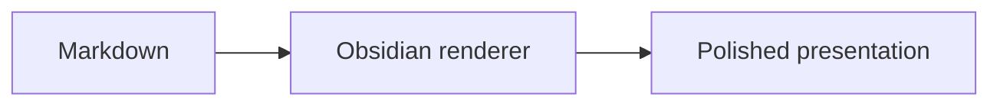

# A complete Markdown showcase

This note exercises **strong text**, *emphasis*, ~~deleted text~~, ==highlighting==, `inline code`, an [external link](https://obsidian.md), and a [[Wikilink]].

> Good typography should make structure obvious without drawing attention away from the content.

## Lists and tasks

1. Ordered item
2. Nested content
   - Unordered item
   - A deliberately long item that wraps across the available reading width without colliding with neighboring content or escaping the note.

- Level one
  - Level two
    - Level three
      - Level four

- [x] Completed task
- [ ] Open task

## Code

```typescript
interface Article {
  title: string;
  publishedAt: Date;
}

export function formatArticle(article: Article): string {
  return `${article.title} (${article.publishedAt.getFullYear()})`;
}
```

```text
This block has no syntax language beyond plain text.
It should still expose the copy action and remain readable.
```

## Data table

| Feature | Reading view | Live Preview | Mobile |
| --- | --- | --- | --- |
| Typography | Supported | Supported | Supported |
| Code tools | Supported | Native editing | Supported |
| Wide tables | Scrollable | Native editing | Scrollable |

## Obsidian content

> [!note] Callout title
> Callouts retain their native semantics while adopting the surrounding rhythm.

> [!warning] Check before publishing
> Semantic color should clarify importance without turning the note into a saturated card.

> [!tip]- Foldable detail
> Native folding remains available with the same restrained presentation.

An embedded note: ![[Another note]]

## Math and diagrams

$$
\int_0^1 x^2\,dx = \frac{1}{3}
$$



## Media


## Footnotes

This sentence contains a footnote.[^1]

[^1]: Footnotes are visually separated at the end of the note.

---

End of the showcase.
